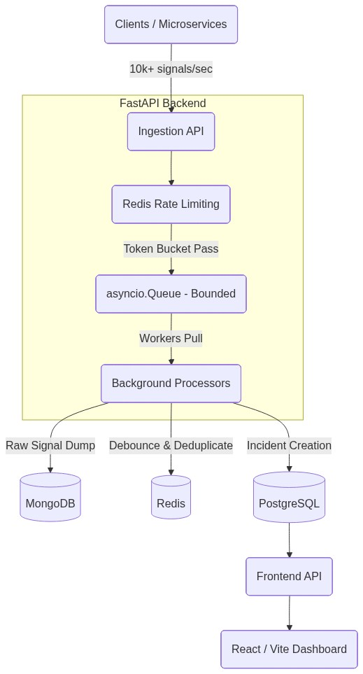
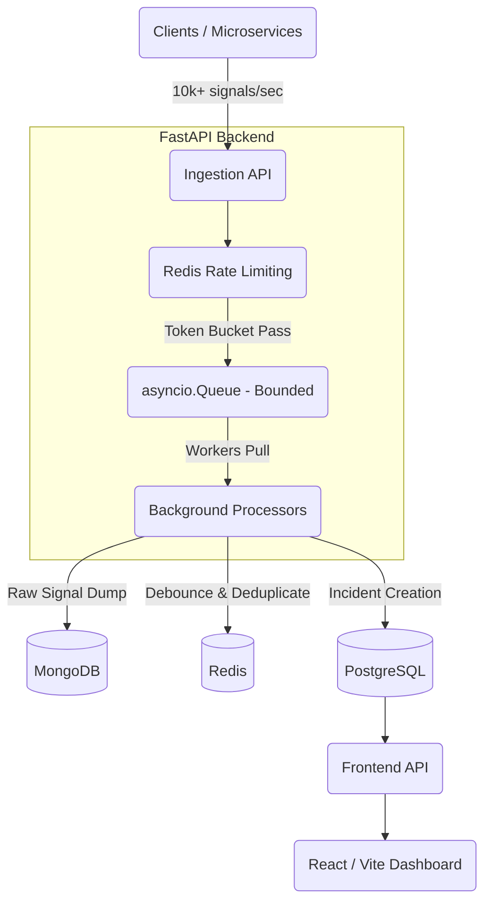

# Incident Management System (IMS)

A mission-critical incident management system designed to ingest high volumes of failure signals from a distributed stack, process them asynchronously, and manage failure mediation workflows.

## Architecture





*   **Ingestion (FastAPI):** High-throughput endpoints to receive signals. Protected by a Redis token-bucket rate limiter.
*   **In-Memory Queue (asyncio.Queue):** Acts as a shock absorber. Signals are quickly placed into the queue to prevent HTTP worker threads from blocking, gracefully handling bursts of up to 10,000 signals/sec.
*   **Background Processors:** Async workers pull from the queue.
    *   *Data Lake:* Dumps raw signals to MongoDB.
    *   *Debouncer:* Uses Redis `SETNX` with a sliding window to collapse redundant alerts.
    *   *Source of Truth:* Creates structured `WorkItems` in PostgreSQL.
*   **Frontend (React/Vite):** A polished, low-load, real-time dashboard to track incident states and submit mandatory RCAs.

## Setup Instructions

1.  **Start Infrastructure:**
    ```bash
    docker-compose up -d
    ```
    *(Requires Docker and Docker Compose. Starts PostgreSQL, MongoDB, and Redis).*

2.  **Start Backend:**
    ```bash
    cd backend
    pip install -r requirements.txt
    uvicorn main:app --reload
    ```
    *(The backend exposes metrics to the console every 5 seconds).*

3.  **Start Frontend:**
    ```bash
    cd frontend
    npm install
    npm run dev
    ```

## Handling Backpressure

Backpressure is managed using a combination of **Redis Rate Limiting** and an **`asyncio.Queue`**. 
If the downstream databases (Postgres/Mongo) experience latency, the `asyncio.Queue` absorbs the burst up to its maximum size. If the queue is full, the API responds with a `503 Server Busy` signal, preventing the application from crashing due to Out-Of-Memory errors. The Token Bucket algorithm additionally prevents malicious or runaway clients from overwhelming the system.

## Simulating Traffic & Failures

Run the simulation scripts to test high-throughput ingestion and failure scenarios:

**1. High-throughput random traffic:**
```bash
pip install aiohttp
python scripts/simulate_traffic.py
```

**2. Cascading Failure Scenario (RDBMS Outage -> MCP Failure):**
```bash
python scripts/simulate_failure.py
```
